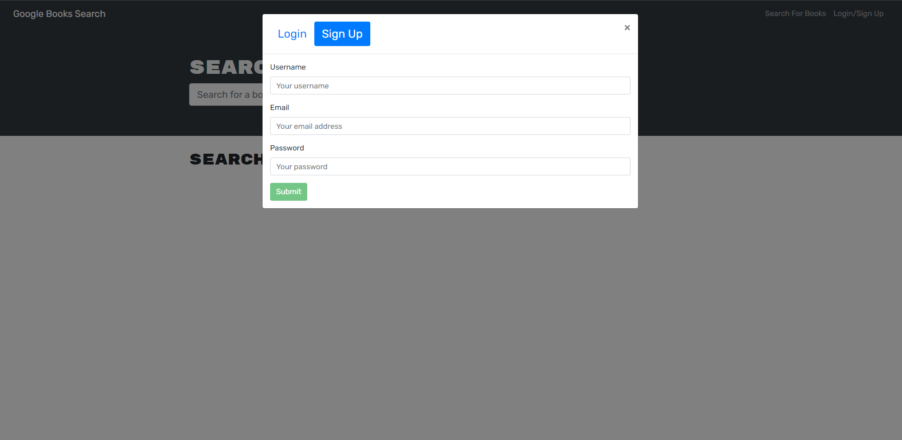
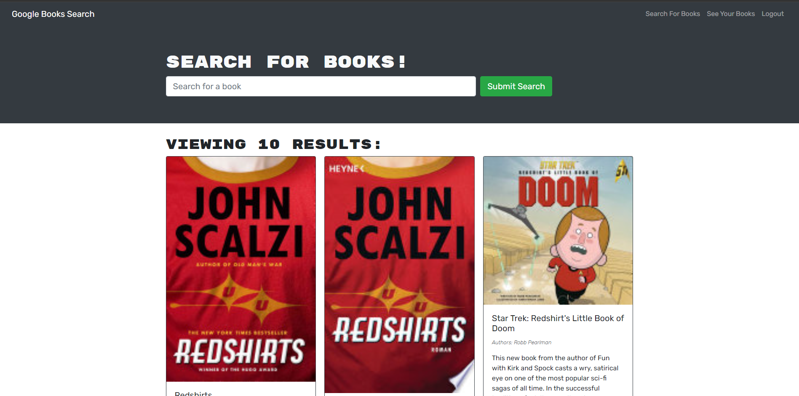
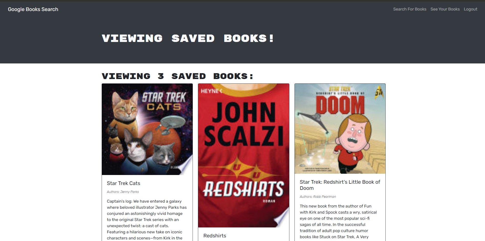

# MERN book search engine

## Descriptions 
Refactor a fully functioning google boos API search engine, replace it's RESTful API with a GraphQl API built with Apollo server. 

## Table of contents
- [Installation](#installation)
  
- [Links](#links) 

- [Screenshots](#Screenshots) 

- [License](#license) 

- [Questions](#questions) 

## Installation
Deployed on Heroku, no installation neccssary.
## Links

[book search engine](https://enigmatic-springs-62655.herokuapp.com/)

[book search engine github repo](https://github.com/realzzkevin/MERN-Book-Search-Engine)

## Screenshots

- 

- 

- 

## License

This project is licensed under the [mit](./LICENSE) license

## Questions
If you have any questions about the repo, Contact me at [realzzkevin@gmail.com](realzzkevin@gmail.com). You can find more of my works at [realzzkevin](https://github.com/realzzkevin)